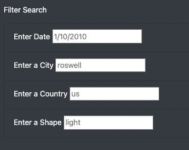

# UFO Sightings
## Overview of Project
In our project, we created a webpage with a dynamic table that provides the depth analysis of UFO sightings by allowing a user to filter for multiple criteria at the same time.

## Results
Our created webpage includes a table with details of UFO sightings like a date, city, state, country, shape, duration, and additional comments. A user has an option to filter the table for a specific date, city, country, or shape to search for specific information as shown in the screenshot below. For convenience, a user can use one filter or all four filters at the same time.  

## Summary

### Drawback of this webpage:
* There is no option to search for UFO sightings by a state.

### Recommendations for further development
* Introduce a date range filter rather than a particular date.
* Introduce a dropdown option for city, country, and shape search boxes with listed options. 

